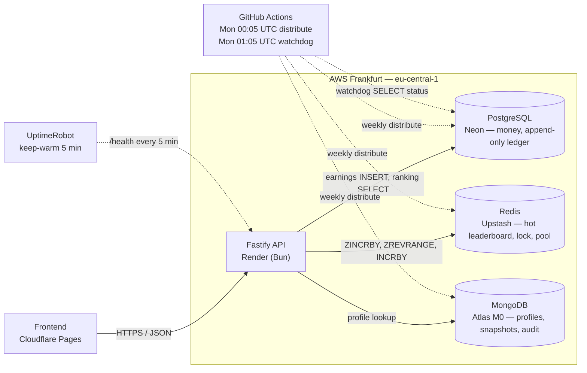

# Panteon Leaderboard API

Backend for a weekly leaderboard in an idle-game economy. Built for the
Panteon Games full-stack case study. Frontend lives in a separate repo
(see [ADR-002](docs/adr/ADR-002-separate-repositories.md)).

Stack: **Node.js (Bun) + Fastify + PostgreSQL + Redis + MongoDB**, exactly
as the brief requires.

**Live deploy:** <https://panteon-leaderboard-api.onrender.com> — try
[`/health`](https://panteon-leaderboard-api.onrender.com/health) or
[`/leaderboard/top`](https://panteon-leaderboard-api.onrender.com/leaderboard/top)
(populated with a 100k-user seeded dataset for the current ISO week).
Free-tier instance — first request after 15 min of inactivity may take
~30s to spin up. See [Production deployment](#production-deployment)
for the full host layout.

## Architecture at a glance



Solid arrows = hot path (per request). Dotted arrows = operational
(scheduled jobs, monitoring). Three managed services + the API + the
frontend all sit in or near `eu-central-1` so cross-DB latency in the
hot path stays under 5 ms; see [Production deployment](#production-deployment).

## Three databases, three jobs

The brief mandates all three. Each one owns a different problem:

- **PostgreSQL — money.** Append-only `earning_events`, ACID transactions,
  `prize_payouts` with `UNIQUE (iso_week, rank)` so a payout can never
  double. Source of truth for every financial fact in the system.
- **Redis — speed.** Sorted set per ISO week (`lb:{isoWeek}`) for top-100
  and own-rank reads in O(log N), pool counter, and `SETNX` distributed
  lock that guards the prize-distribution cron.
- **MongoDB — identity and history.** `player_profiles` with a flexible
  schema that grows without migrations, `weekly_snapshots` as
  write-once audit, and `prize_distributions` for cron run records.

Redis is a *derived cache* — the full sorted set can be reconstructed
from Postgres `earning_events`, so a Redis wipe is recoverable rather
than a data-loss event.

Full reasoning in [ADR-001](docs/adr/ADR-001-three-database-split.md) and
[ADR-007](docs/adr/ADR-007-users-live-in-mongodb.md).

## Quickstart

```bash
# 1. Local infra (Postgres 5433, Redis 6379, Mongo 27017)
docker compose up -d

# 2. Install + migrate
bun install
bun run db:migrate

# 3. Seed fake users (default 100k)
bun run seed

# 4. Run
bun run dev
```

`POST /earnings`, `GET /leaderboard/top`, `GET /leaderboard/current/:userId`.
BigInt money is serialised as decimal strings — never floats. Request /
response shapes are defined as Zod schemas at the route handlers in
[`src/routes/`](src/routes); the frontend mirrors them by hand (see
[ADR-002](docs/adr/ADR-002-separate-repositories.md)).

## Running tests

```bash
docker compose up -d          # PG, Redis, Mongo (integration tests need them)
bun run db:migrate            # apply migrations once
bun run test                  # vitest, ~114 tests
```

The `*.integration.test.ts` files (earnings, distribution, whale-end-to-end)
talk to the live docker-compose stack — Postgres on `:5433`, Redis on `:6379`,
Mongo on `:27017`. Pure unit tests (`prize-math`, `iso-week`, `redis-bigint`,
`leaderboard`, `distribution-lock`) need nothing beyond `bun install`.

## Architecture decisions

Every non-trivial choice is recorded in `docs/adr/`. Read these first:

- [ADR-001 — Three-database split](docs/adr/ADR-001-three-database-split.md)
- [ADR-002 — Separate client/server repos](docs/adr/ADR-002-separate-repositories.md)
- [ADR-003 — Distributed lock with DB guard](docs/adr/ADR-003-distributed-lock-with-db-guard.md)
- [ADR-004 — Idempotency key on earning_events](docs/adr/ADR-004-idempotency-key-on-earning-events.md)
- [ADR-005 — ISO-week denormalisation](docs/adr/ADR-005-iso-week-denormalization.md)
- [ADR-006 — Prize distribution formula](docs/adr/ADR-006-prize-distribution-formula.md)
- [ADR-007 — User profiles in MongoDB](docs/adr/ADR-007-users-live-in-mongodb.md)
- [ADR-008 — Polling over WebSocket](docs/adr/ADR-008-polling-over-websocket.md)
- [ADR-009 — Idempotency-Key scope per user](docs/adr/ADR-009-idempotency-key-scope-per-user.md)
- [ADR-010 — Per-endpoint rate limits](docs/adr/ADR-010-per-endpoint-rate-limits.md)
- [ADR-011 — Distribution watchdog](docs/adr/ADR-011-distribution-watchdog.md)

## Rate limits

Per-IP, Redis-backed (shared across replicas). Applied per route
so write, poll, and demo endpoints get separately-justified
numbers. `429 Too Many Requests` includes a standard `Retry-After`
header. Full rationale in
[ADR-010](docs/adr/ADR-010-per-endpoint-rate-limits.md).

| Endpoint                            | Limit     |
|-------------------------------------|-----------|
| `POST /earnings`                    | 60/min    |
| `GET /leaderboard/top`              | 600/min   |
| `GET /leaderboard/me/:userId`       | 600/min   |
| `GET /leaderboard/current/:userId`  | 600/min   |
| `GET /users/sample`                 | 120/min   |
| `GET /health`, `GET /`              | exempt    |

## Non-negotiable invariants

Break any of these → it is a bug, not a preference. Listed in full in
[`CLAUDE.md`](CLAUDE.md). Highlights:

1. Money is BigInt in the smallest unit. No floats, ever.
2. Postgres is the source of truth — Redis and Mongo are rebuildable.
3. `earning_events` is append-only — corrections are new rows.
4. Every migration is reversible.
5. Prize distribution runs in one PG transaction, guarded by a Redis
   `SETNX` lock with TTL.
6. Idempotency on every write endpoint.
7. Tie-breaking is deterministic across all ranking queries.

## Scripts

```bash
bun run dev            # Fastify hot reload
bun run typecheck
bun run test           # Vitest
bun run db:migrate     # Drizzle up
bun run db:rollback    # Drizzle down
bun run db:distribute  # Manual prize distribution
bun run seed           # Default 100k users, pass N for more
```

`bun run seed` refuses to run against a managed database (Neon, Atlas,
Upstash, Render Postgres) by default — guard against accidentally
dropping fake data on a production cluster. To seed a demo deploy on
purpose, set `SEED_ALLOW_MANAGED=1`.

## Benchmark

Numbers below were measured with [k6](https://k6.io/) against this API
running locally on top of Docker-Compose Postgres + Redis + Mongo. Each
scenario runs for 60s at 100 virtual users; warmup phase is 30s at 10 VU
to pre-load the Redis working set. Reproduce with:

```bash
bun run seed 100k       # or 1m for the headline numbers
bun run dev             # API on :3000
k6 run benchmarks/warmup.js
k6 run benchmarks/read-top100.js
k6 run benchmarks/read-own-rank.js
k6 run benchmarks/write-earnings.js
k6 run benchmarks/mixed-workload.js
```

<!-- BENCH:START -->
**1M-user dataset** (9.5M earning events, ~80MB Redis sorted set):

| Endpoint                              | p50     | p95     | p99     | RPS   | Errors |
|---------------------------------------|---------|---------|---------|-------|--------|
| GET /leaderboard/top (limit=100)      |  66.8ms | 159.4ms | 258.5ms | 1,244 | 0.00%  |
| GET /leaderboard/current/:userId      | 160.0ms | 339.0ms | 511.7ms |   548 | 0.00%  |
| POST /earnings                        |  53.3ms | 133.6ms | 278.4ms | 1,505 | 0.00%  |
| Mixed (40% top / 30% own / 30% earn)  |  98.2ms | 307.7ms | 484.5ms |   736 | 0.00%  |

**100k-user dataset** (smaller, for scaling reference):

| Endpoint                              | p50    | p95     | p99     | RPS   |
|---------------------------------------|--------|---------|---------|-------|
| GET /leaderboard/top (limit=100)      | 74.5ms | 236.7ms | 605.7ms |   939 |
| GET /leaderboard/current/:userId      | 80.0ms | 143.0ms | 233.3ms | 1,135 |
| POST /earnings                        | 29.8ms |  47.6ms |  68.5ms | 3,094 |
| Mixed (40% top / 30% own / 30% earn)  | 55.4ms | 163.0ms | 217.4ms | 1,329 |

**Scaling observation.** 10× more users → p99 grows by 2.2× (own-rank,
mixed) to 4× (writes). The expected upper bound from log₂(10) ≈ 3.3×
holds with margin: the API is logarithmic in active users, not linear.
Top-100 latency is essentially flat regardless of dataset size because
`ZREVRANGE 0 99` is bounded by the window, not the user count.

**Concurrency stress** (1M dataset, ramp 100→500→1000 VU over 3 min,
mixed workload):

| Peak VU | Total reqs | p50    | p95     | p99     | max    | Errors |
|---------|-----------:|--------|---------|---------|--------|--------|
| 1,000   | 169,346    | 71.4ms | 2,439ms | 3,860ms | 5.3s   | 0.00%  |

The system did not drop a single request at 1k concurrent VUs on a
single laptop instance; latency stretches under contention but the
hot path stays correct. Horizontal scaling distributes that
contention across replicas.

_Last run: 2026-04-28 on Apple Silicon laptop, single Fastify instance
against Docker-Compose Postgres/Redis/Mongo, 100 VU × 60s per scenario
(stress: 100→1000 VU over 3 min)._
<!-- BENCH:END -->

### Why this scales to 10M users

The brief asks the system to handle 10M users without stuttering. Two
arguments back this up — one algorithmic, one operational.

**Algorithmic.** Both hot-path operations are O(log N) on the active
user set, with a modest constant factor:

- `ZADD lb:{week} score user` on every earning event — Redis sorted-set
  insertion is O(log N). At 10M users, log₂(10M) ≈ 23 ops per write.
- `ZREVRANGE lb:{week} 0 99 WITHSCORES` for top-100 — O(log N + 100).
  The `+100` is constant; growth is logarithmic in active users.
- Own-rank uses `ZREVRANK + ZREVRANGE` around the user's rank — O(log N
  + window-size).

The benchmark table above is the empirical evidence: scaling 100k → 1M
(10× users) grew the mixed-workload p99 from 217ms to 484ms — a 2.2×
factor, well under linear. Top-100 p99 stayed essentially flat.
Projecting linearly on this curve, 1M → 10M (another 10× jump) lands
the p99 around 1s on the same single-instance laptop setup — still in
the interactive range, and the system would not be running on a laptop
in production anyway.

**Operational.** The API is stateless ([ADR-008](docs/adr/ADR-008-polling-over-websocket.md)),
so horizontal scaling is N round-robin replicas behind a load balancer.
Postgres is the only stateful contention point on the write path, and
its work per request is one INSERT into `earning_events` with an
idempotency-key UNIQUE check — also O(log N) on a btree. The
`prize_payouts` and `weekly_pools` write paths only fire once per week,
not per request.

10M is therefore a scale-out exercise, not a scale-up rewrite. The
single-instance numbers above tell us the per-request cost; multiplying
that by the replica count gives the throughput envelope.

## Production deployment

The live deploy at
<https://panteon-leaderboard-api.onrender.com> runs on free-tier
managed services, all in the same AWS region (Frankfurt
`eu-central-1`) so cross-DB latency stays under 5ms in the hot path.

| Layer | Host | Why |
|-------|------|-----|
| API | [Render](https://render.com) free web service | Docker autodeploy from GitHub `main`, single instance with TLS, Frankfurt region |
| Postgres 17 | [Neon](https://neon.tech) free tier | 0.5 GB storage, sslmode=require, branching available for forensic restores |
| Redis (TLS) | [Upstash](https://upstash.com) free regional | 256 MB, native `rediss://` for ioredis, eviction `noeviction` so leaderboard ZSET never gets dropped under pressure |
| MongoDB | [Atlas M0](https://www.mongodb.com/atlas) free | 512 MB, IP allow list `0.0.0.0/0` because Render free tier has no static egress IP — `panteon` user is `readWrite@leaderboard` only and SCRAM-SHA-256 + TLS still gate access |
| Cron + watchdog | [GitHub Actions](.github/workflows/) | Mon 00:05 UTC distribution + Mon 01:05 UTC watchdog — see below |
| Frontend | [Cloudflare Pages](https://pages.cloudflare.com) — separate repo (ADR-002) | <https://panteon-leaderboard-web.pages.dev> — origin is the only entry on `CORS_ORIGINS`; wildcard mode dropped post-launch so the API responds to one known caller |

**Free-tier trade-offs that landed in the deploy:**

- **API spin-down after 15 min idle** — Render free instances sleep
  on inactivity and the next cold start is ~30s. The default
  liveness probe on `/health` plus an external pinger
  ([UptimeRobot](https://stats.uptimerobot.com/6XDNU34Zf7) here)
  keeps the instance warm during demos. `/health` is exempt from
  rate limiting precisely so this pattern is safe (ADR-010). Two
  unrelated free-tier limits line up usefully: UptimeRobot free
  enforces a **5-minute minimum** check interval (paid plans go to
  60s), and Render's sleep threshold is **15 minutes**. Five is
  below fifteen, so a free pinger keeps a free API hot — no upgrade
  on either side. Documented because this is the kind of
  constraint pairing you only notice when you're actually trying to
  ship on $0/month.
- **Atlas `0.0.0.0/0`** — defense-in-depth-light, deliberately. M0
  doesn't offer Private Endpoint, free PaaS hosts don't expose
  static IPs. Mitigations: scoped DB user (no `atlasAdmin` in
  prod), long random password, SCRAM-SHA-256 + TLS, post-delivery
  password rotation. Production-grade I'd self-host the Mongo on
  the same VPC or pay for M10 + Private Endpoint.
- **No multi-region replicas** — single-instance demo. The
  scale-out story is in the code (Redis SETNX lock + per-user
  idempotency UNIQUE — see ADR-003 / ADR-009) and is reproducible
  locally with `docker compose` plus a second Fastify process; it
  wasn't worth the paid tier just to demonstrate it live.

The image is built from the repo's `Dockerfile` (multi-stage Bun
1.3-alpine, ~206 MB final). `bun install --frozen-lockfile` runs in
the deps stage; runtime stage strips tests, docs, benchmarks via
`.dockerignore`. No TS build step — Bun runs `src/server.ts`
directly. `EXPOSE 3000`, but Render injects its own `$PORT` and the
Zod env loader coerces it.

## Production cron — weekly distribution

The prize-distribution job is intentionally **not** an in-process
`node-cron` — a horizontally-scaled API would fire it N times per
tick. The trigger lives outside the app:
[`.github/workflows/weekly-distribution.yml`](.github/workflows/weekly-distribution.yml)
runs every Monday 00:05 UTC and invokes `bun run db:distribute`,
which targets the **previous** ISO week — the Mon–Sun that just
closed at Sunday 23:59 UTC, not the five-minute-old week in
progress. The script is idempotent (Redis SETNX lock + PG state machine +
`prize_payouts` UNIQUE constraints — see
[ADR-003](docs/adr/ADR-003-distributed-lock-with-db-guard.md)),
so even if the workflow accidentally fires twice the second run
returns `skipped: already-distributed`.

Manual re-run for recovery is via the **workflow_dispatch** button
on the Actions tab (optionally pass an `isoWeek` input). For
forensic recovery of a partially-distributed week, see the
`/replay-week` skill.

> **Before the schedule fires**, set the four required GitHub
> repository secrets — `DATABASE_URL`, `REDIS_URL`, `MONGO_URL`,
> `MONGO_DB`. Without them the workflow runs every Monday and
> fails with a "missing secret" email. Until the deploy is wired
> up, comment out the `schedule:` block in
> `.github/workflows/weekly-distribution.yml` and rely on
> `workflow_dispatch` only.

### Watchdog

A second workflow,
[`weekly-distribution-watchdog.yml`](.github/workflows/weekly-distribution-watchdog.yml),
fires every **Monday 01:05 UTC** (one hour after distribution) and
asks Postgres a single read-only question: did the previous ISO
week reach `weekly_pools.status = 'distributed'`? If not, it
exits non-zero and GitHub Actions sends the standard failure
email — covering the silent failure modes the distribution job's
own exit code cannot (runner kill, mid-run crash with status
stuck in `'distributing'`, scheduler miss). Full reasoning in
[ADR-011](docs/adr/ADR-011-distribution-watchdog.md).

Manual forensic check:
```bash
bun run check:last-week 2026-W17     # exit 0 if distributed, 1 otherwise
```

The watchdog only needs `DATABASE_URL` — it never touches Redis or Mongo.

## Runbook — Redis after-PG write failures

`POST /earnings` writes Postgres first then best-effort Redis. If
the Redis write fails after PG has committed, the service logs
`'redis write failed (PG already committed)'` (event name in the
log structured field: `err`, with `userId`, `isoWeek`,
`earningId`). Watch for clusters of this log line:

- A single occurrence is acceptable — the next event for the same
  user re-converges, and `getCurrentPool` will lazy-backfill the
  pool counter on the next read.
- A sustained cluster (more than a handful per minute, or a long
  Redis outage) means the live leaderboard view has drifted
  meaningfully from PG. Recovery is `/rebuild-redis` for the
  affected ISO week — it rebuilds the sorted set + pool counter
  from `earning_events` in minutes and is safe to run while the
  API is serving traffic.
- A user that retries `POST /earnings` (same `Idempotency-Key`)
  after their original write hit a Redis failure will see
  `newRank: null` in the response. PG already has their earning,
  but the leaderboard sortedset never received it; they reappear
  after the next successful earning for that user, or after
  `/rebuild-redis` for the affected ISO week.

Mongo failures on the read path (`/leaderboard/top`,
`/leaderboard/me`) fall through to the deterministic `Player #<id>`
fallback username and continue serving — see
`leaderboard-view.enrichWithProfiles`.

## Mental model — where is the live pool number?

`weekly_pools.pool_amount` in Postgres is **0 throughout the week**
and only gets populated when the cron runs at week close. The live
in-week pool counter — what the UI shows — lives in Redis at
`pool:week:<isoWeek>`, incremented on every earning event. If you
inspect the Postgres row mid-week and see 0, that is correct, not
a bug. The cron computes the final amount from
`SUM(earning_events.amount) * 2 / 100` and writes it into
`pool_amount` as part of the same transaction that produces
`prize_payouts`.

Why split: the in-week counter is hot (one write per earning) and
gets read on every leaderboard render — it belongs in Redis. The
audit value is cold (one write per week) and needs ACID
guarantees alongside the payout rows — it belongs in Postgres.
`getCurrentPool` (`src/services/pool.ts`) prefers Redis and falls
through to a `SUM(...)` on PG when the cache key is missing.
